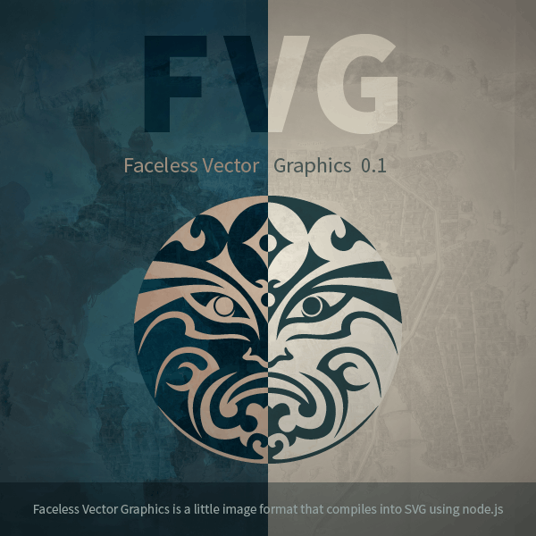

# Faceless Vector Graphics



**Faceless Vector Graphics is a little image format that compiles into SVG using node.js** It came about because I needed a method to dynamically generate SVGs from a template through a node-webkit app. While SVGs can use style sheets to change appearance or be created from scratch using [svg.js](http://svgjs.com/) or [snap.svg](http://snapsvg.io/) — I could find nothing that allowed me to start with a template, pass it variables through a JSON, and embed (**!**link) SVGs within SVGs.

Inspired by and written in Coffeescript, themed after the Guild of Faceless Men, FVG aims to make SVGs easily programmable without complex scripts. Version 0.1 includes just two methods and is compiled with two functions. Plans for future versions include passing parameters, embedding javascript for semantic variables, and SVG generation through [svg.js](http://svgjs.com/) or [snap.svg](http://snapsvg.io/).

## How to use

### 1. Installation

```
$ npm install fvg
```

### 2. Setting it up

#### Rename
Grab your SVG file and change the extension to `.fvg`. **If** you're on a Mac, double-check to make sure it's not `.fvg.svg`.

#### Getting variables from a JSON 
Open your new FVG file and after the `<svg ... >` tag:

```javascript
// input.fvg
ƒ.link{ "path/to/file.json" }
// Note the `ƒ` is a florin sign which is `Opt+F` on a Mac
```

```javascript
// file.json
{
	"some_text": "Valar Morgulis",
	"a_color": "#819090"
}
```

Referencing a JSON property:

```xml
<!-- input.fvg -->
<rect fill="ƒ{a_color}" width="300" height="200"/>`
```
or
```xml
<!-- input.fvg -->
<text x="150" y="110" text-anchor="middle" fill="#fefee2" font-size="24">ƒ{some_text}</text>
```

#### Embedding SVG XML
I needed to directly embed external SVG elements (not link using `<image xlink:href="file.svg"/>`) so I created an echo method which grabs the text of the linked file:

```xml
<!-- input.fvg -->
<defs>
	ƒ.echo{ "path/to/file.xml" }
</defs>
```

```xml
<!-- file.xml -->
<rect id="a_kindly_rect" width="240" height="100"/>
```

### 3. Compiling it

#### Inside your node.js file 
```javascript
var fvg = require( 'fvg' );
```

#### don_svg( input, output )
Generates a SVG file
```javascript
fvg.don_svg( 'input.fvg', 'output.svg' );
```

#### don_png( input, output, [ratio, optimize])
Generates a PNG file, if unspecified the third argument defaults to [1, true]
```javascript
fvg.don_png( 'input.fvg', 'output.png' );
```

### 4. Output

#### output.svg
```xml
<svg version="1.1" xmlns="http://www.w3.org/2000/svg" xmlns:xlink="http://www.w3.org/1999/xlink" x="0px" y="0px" width="300px" height="200px" viewBox="0 0 300 200">
	<defs>
		<rect id="a_kindly_rect" width="240" height="100"/>
	</defs>
	<rect fill="#819090" width="300" height="200"/>
	<use x="30" y="50" fill="#465b62" xlink:href="#a_kindly_rect"/>
	<text x="150" y="110" text-anchor="middle" fill="#fefee2" font-size="24">Valar Morghulis</text>
</svg>
```

#### output.png


## How it works

TODO: write this.

## Notes

This has only been tested on Mac OS X 10.9.2. I'm not experienced enough to maintain this for all platforms or figure out why it doesn't work on your computer. It's just an experiment I did to solve a very specific challenge.
